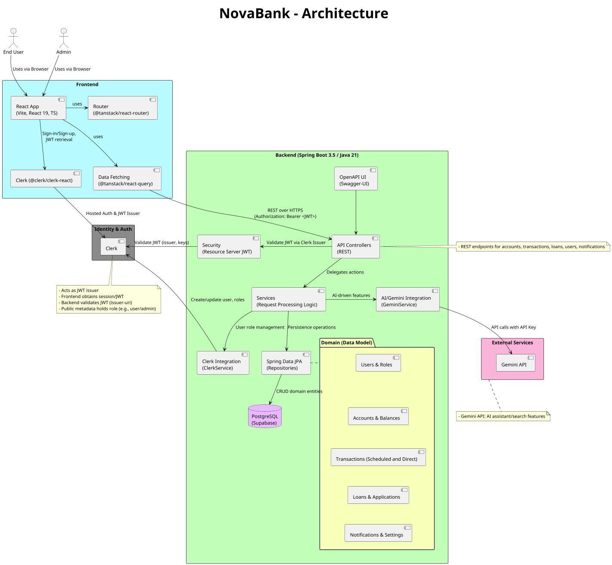

# JFS 2025 Final Project: Bank App - Nova Bank AB

### 🚀 Introduction
Nova Bank AB is a modern, learning-focused digital banking application built as the JFS 2025 Final Project. 
It simulates a real-world retail banking experience. 
The app features and handles:
- User applications
- User & Account management
- Transactions
- Transfers
- Loans
- AI transaction search
- AI transaction tag system
- Admin panel with an administration and statistics interface. 

All of this is developed to be secure, responsive, and provide an accessible web experience for both desktop and mobile users.

Other features not yet finished are:
- Currency system
- Stocks
- Pension

#### Presentation
- [**Full Presentation**](https://youtu.be/nE_16cvehM0?t=399)  
- [**User Demo**](https://youtu.be/nE_16cvehM0?t=1389)  
- [**Admin Demo**](https://youtu.be/nE_16cvehM0?t=1928)

### 👥 Team & Roles

### Team Structure
#### Backend Team
- Domain modeling
- API design
- Data persistence
- Security.
- Reliability

#### Frontend Team
- User interface
- Accessibility
- Interaction design.
- State management
- Routing
- Data visualization.

#### CI/CD Team
- Build pipelines
- Test orchestration
- Automated deployments
- Environment provisioning
- Observability,
- Ensures release readiness

#### Roles
- Project Manager
  - Responsible for holding and planning meetings
  - Coordinates inter-team communication and collaboration.
      
- Product Lead
  - Defines product vision, priorities, and scope.
  - Drives trade-offs and decision-making with stakeholder in mind.
  - Ensures the product delivers clear user value and aligns with goals.
      
- Technical Lead
  - Ensures the product is built with best practices and standards.
  - Provides technical guidance and direction.
      
- UI Lead
  - Sets UI/UX standards, visual style, and component guidelines.
  - Reviews flows for usability, accessibility, and consistency.
  - Partners with Frontend to deliver polished user experiences.
      
- Presentation Lead
  - Crafts the narrative for demos and the final presentation.
  - Curates story, visuals, and timing
  - Delegates speaking roles.
  - Aligns presentation with project goals, product value, and target audience.

#### Project Crew
- [Daniel Sandström](https://github.com/Dansan-Dev)
- [Samuel Karlhager](https://github.com/samuel-kar)
- [Nikita Mokhonko](https://github.com/NikitaMokhonko)
- [Andreas Kamf](https://github.com/akamf)
- [Baset Kazemi](https://github.com/Kazemi24)
- [Ikbal Gundogdu](https://github.com/ikgun)
- [Elias Egelrud](https://github.com/EliasEgel)
- [Amanda Ström](https://github.com/AmandaEmilia)
- [David Aslan](https://github.com/david11267)
- [Manuel Acevedo](https://github.com/acolote1998)
- [Ludwig Hahn](https://github.com/ludwig-dev)

### 💻 Architecture

 

 

<a href="documentation_materials/architecture.png">
  Go to PNG
</a>

### 🧰 Technologies
- **Backend**
  - Java 21
  - Spring Boot
    - Web MVC
    - Security
    - Data JPA
  - OAuth2 Resource Server (JWT)
  - PostgreSQL (production)
  - H2 Database (local/testing)
  - Springdoc OpenAPI (Swagger UI)
  - Maven
    
- **Frontend**
  - React 19
  - React DOM 19
  - TypeScript 5.7
  - Vite 6
  - Tailwind CSS 4
  - DaisyUI
  - Radix UI (Dialog, Select, Tabs, Slot)
  - TanStack React Query, Router, Router Devtools, Router Plugin, React Table
  - i18next + react-i18next (with browser language detector and HTTP backend)
  - Lucide React (icons)
  - class-variance-authority, clsx
  - React Toastify
  - tw-animate-css
  - SockJS Client, STOMP.js (@stomp/stompjs)
      
- **CI/CD**
    - Docker (Dockerfile, docker-compose.yml)
    - Supabase
    - GCP
    - GitHub Actions
    - JUnit
        
- **Authentication**
  - Clerk (backend JWT issuer integration, frontend @clerk/clerk-react)
